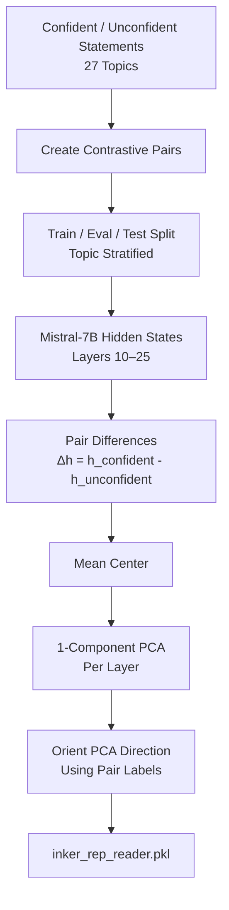
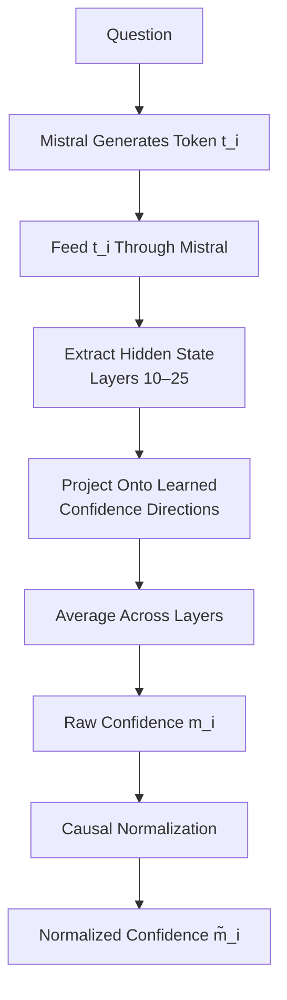
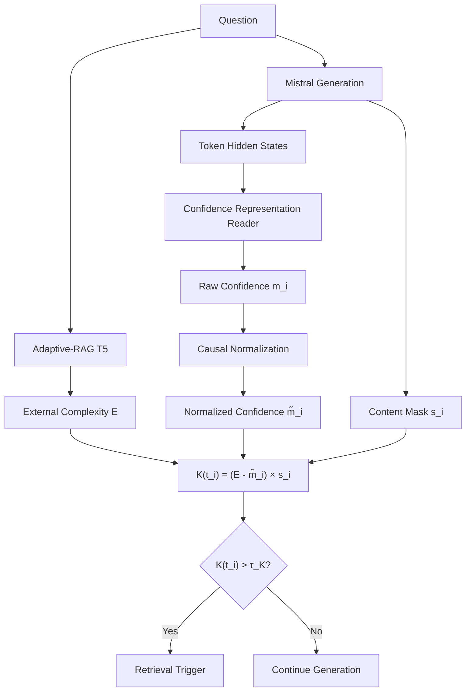

# INKER IE-KRT Replication

This repository contains a modular replication of the **retrieval-trigger component of INKER (IE-KRT)**.

INKER determines **when external retrieval should be activated** by combining two signals:

1. **Internal knowledge / confidence** — estimated from hidden representations of Mistral-7B.
2. **External query complexity** — estimated using an Adaptive-RAG-style T5 classifier.

For every generated token $t_i$, the two signals are combined as:

$$
K(t_i) = (E-\tilde{m}_i)s_i
$$

where:

- $E$ is the question-level external complexity score,
- $\tilde{m}_i$ is the normalized confidence of generated token $i$,
- $s_i$ is a content-token mask,
- $K(t_i)$ is the retrieval activation score.

Retrieval is triggered when:

$$
K(t_i) > \tau_K
$$

The default replication threshold is:

$$
\tau_K=0.5
$$

> **Scope:** this repository currently implements **IE-KRT — when retrieval should occur**. It detects the point at which retrieval would be triggered. It does not yet implement the complete IE-KQF retrieval, reranking, evidence-injection, and generation-resumption pipeline.

---

# 1. System Overview

The implementation contains two independently testable components that are later combined.

## 1.1 Internal Confidence Detector

The first component estimates how confident Mistral is in its generated tokens.

The detector is trained from paired **confident** and **unconfident** statements.



For layer $l$, the hidden states of a confident/unconfident pair are used to construct:

For each confident/unconfident pair, the hidden-state difference at layer $l$ is:

$$
\Delta h_i^{(l)} = h_{C,i}^{(l)} - h_{U,i}^{(l)}
$$

where:

* $h_{C,i}^{(l)}$ is the hidden state of the **confident** example,
* $h_{U,i}^{(l)}$ is the hidden state of the **unconfident** example,
* $\Delta h_i^{(l)}$ is the resulting pair-difference vector.

For $N$ training pairs, these vectors are collected into a difference matrix:

$$
\Delta H^{(l)} \in \mathbb{R}^{N \times 4096}
$$

Each row of $\Delta H^{(l)}$ corresponds to one confident/unconfident pair:

```text
ΔH^(l)

Pair 1  →  Δh₁^(l)
Pair 2  →  Δh₂^(l)
Pair 3  →  Δh₃^(l)
...
Pair N  →  Δhₙ^(l)
```

One-component PCA is then applied to $\Delta H^{(l)}$ to learn one confidence direction for layer $l$:

$$
v^{(l)} \in \mathbb{R}^{4096}
$$

The current INKER replication uses Mistral layers **10 through 25**:

```text
10, 11, 12, 13, 14, 15, 16, 17,
18, 19, 20, 21, 22, 23, 24, 25
```

This produces a total of **16 learned confidence directions**, one for each selected layer.

The learned directions, centering vectors, and orientation signs are stored in:

```text
models/inker_rep_reader.pkl
```

---

## 1.2 Token-Level Confidence During Generation

After training, the representation reader can estimate confidence while Mistral generates an answer.

For each newly generated token:



For each layer, the token representation is projected onto the learned confidence direction.

For each selected layer $l$, the generated token's hidden state is projected onto the learned confidence direction:

$$
m_i^{(l)} = s^{(l)} (h_i^{(l)} - \mu^{(l)}) \cdot v^{(l)}
$$

where:

* $h_i^{(l)}$ is the hidden-state vector of token $i$ at layer $l$,
* $\mu^{(l)}$ is the mean vector used to center the representations,
* $v^{(l)}$ is the learned PCA confidence direction,
* $s^{(l)}$ is the PCA orientation sign,
* $m_i^{(l)}$ is the confidence score of token $i$ at layer $l$.

The scores from all selected layers are then averaged to obtain a single raw confidence score for token $i$:

$$
m_i = \frac{1}{L} \sum_{l=1}^{L} m_i^{(l)}
$$

where $L$ is the number of selected layers. In this replication, layers **10 through 25** are used, so $L=16$.

The raw confidence score is then causally normalized to produce:

$$
0 \leq \tilde{m}_i \leq 1
$$

where $\tilde{m}_i$ is the normalized confidence of token $i$.

The normalization is **causal**: when computing $\tilde{m}_i$, only the raw confidence scores observed up to the current token are used:

$$
m_0, m_1, \ldots, m_i \;\rightarrow\; \tilde{m}_i
$$

Future tokens are therefore never used to modify the confidence assigned to an earlier token.

---

# 2. External Query Complexity Evaluator

The second component estimates how much retrieval a question is likely to require.

This replication uses the pretrained Adaptive-RAG-style T5 model:

```text
LenckCuak/Adaptive-RAG
```

rather than retraining the complexity classifier as part of the primary experiment.

> This checkpoint is a third-party Adaptive-RAG reproduction, not an official INKER checkpoint. Its provenance should therefore be stated when reporting replication results.

The evaluator predicts three Adaptive-RAG routing classes:

| Class | Interpretation |
|---|---|
| `A` | No retrieval |
| `B` | Single-step retrieval |
| `C` | Multi-step / iterative retrieval |

The model produces:

$$
P(A),\quad P(B),\quad P(C)
$$

with:

$$
P(A)+P(B)+P(C)=1
$$

## 2.1 Converting A/B/C to Continuous Complexity $E$

The exact continuous conversion used internally by INKER is not fully specified by the available implementation details.

Therefore this repository explicitly uses the following **replication assumption**:

$$
A\rightarrow0
$$

$$
B\rightarrow0.5
$$

$$
C\rightarrow1
$$

The continuous external complexity score is calculated as the probability-weighted expectation of the three Adaptive-RAG classes:

$$
E = 0 \cdot P(A) + 0.5 \cdot P(B) + 1 \cdot P(C)
$$

Since the contribution of class $A$ is zero, this simplifies to:

$$
E = 0.5 \cdot P(B) + P(C)
$$

where:

* $P(A)$ is the probability that **no retrieval** is required,
* $P(B)$ is the probability that **single-step retrieval** is required,
* $P(C)$ is the probability that **multi-step retrieval** is required.

The resulting complexity score is bounded between 0 and 1:

$$
0 \leq E \leq 1
$$

A value closer to **0** indicates a query predicted to require little or no retrieval, while a value closer to **1** indicates a stronger predicted need for retrieval.

This mapping is a **replication design choice**, not a claim that INKER explicitly defines the exact same conversion.

---

# 3. Combining Confidence and Complexity: IE-KRT

The full retrieval trigger combines the static question complexity $E$ with the dynamic token confidence $\tilde m_i$.



For every generated token:

$$
\boxed{
K(t_i)=(E-\tilde m_i)s_i
}
$$

The content mask is:

$$
s_i=
\begin{cases}
1 & \text{content token}\\
0 & \text{stopword / non-content token}
\end{cases}
$$

so non-content tokens cannot directly trigger retrieval.

### Example

Suppose:

$$
E=0.90
$$

and a content token has:

$$
\tilde m_i=0.22
$$

Then the activation score is:

$$
K(t_i) = (0.90 - 0.22) \cdot 1 = 0.68
$$

Since the retrieval threshold is $\tau_K = 0.5$:

$$
0.68 > 0.5
$$

the token **triggers retrieval**.

With:

$$
\tau_K=0.5
$$

we obtain:

$$
0.68>0.5
$$

and retrieval is triggered.

By contrast, if confidence is high:

$$
E=0.90,\qquad
\tilde m_i=0.80
$$

then:

$$
K(t_i)=0.10
$$

and retrieval is not triggered.

This captures the central idea of IE-KRT:

> A difficult question does not necessarily require retrieval if the model remains internally confident, while low confidence becomes more important when the external complexity of the question is high.

---

# 4. Repository Structure

```text
inker-confidence-detector/
├── README.md
├── requirements.txt
├── .gitignore
│
├── configs/
│   └── default.yaml
│
├── data/
│   └── README.md
│
├── docs/
│   ├── methodology.md
│   ├── replication.md
│   └── results.md
│
├── experiments/
│   ├── _common.py
│   ├── train_detector.py
│   ├── evaluate_detector.py
│   ├── test_complexity_evaluator.py
│   ├── run_confidence_only.py
│   ├── run_inker_trigger.py
│   └── run_test_suite.py
│
└── src/
    └── inker/
        ├── config.py
        ├── dataset.py
        ├── direction.py
        ├── generation.py
        ├── hidden_states.py
        ├── model.py
        ├── scoring.py
        ├── complexity.py
        └── trigger.py
```

---

# 5. Google Drive Layout

The repository code is cloned into the temporary Colab runtime.

Datasets, trained models, and experiment results are stored in Google Drive so they persist after the Colab session ends.

The default configuration expects:

```text
/content/drive/MyDrive/INKER_Confidence_Detector/
├── datasets/
│   └── confidence_statements1.json
│
├── models/
│   ├── inker_rep_reader.pkl
│   └── inker_rep_reader_metadata.json
│
├── results/
│   ├── replication/
│   ├── confidence_only/
│   ├── complexity_eval/
│   └── full_k/
│
└── logs/
```

The root directory is configured in:

```text
configs/default.yaml
```

---

# 6. Google Colab: Complete Setup

The following steps are intended to be executed sequentially in a Google Colab notebook.

## Step 1 — Enable a GPU

In Google Colab:

**Runtime → Change runtime type → Hardware accelerator → GPU**

Then verify CUDA:

```python
import torch

print("PyTorch:", torch.__version__)
print("CUDA available:", torch.cuda.is_available())

if torch.cuda.is_available():
    print("GPU:", torch.cuda.get_device_name(0))
```

You should see:

```text
CUDA available: True
```

A GPU is strongly recommended because the confidence detector extracts hidden states from Mistral-7B.

---

## Step 2 — Mount Google Drive

```python
from google.colab import drive

drive.mount("/content/drive")
```

This allows trained models and experiment results to persist after the Colab runtime disconnects.

---

## Step 3 — Clone the Repository

```bash
%cd /content
!git clone https://github.com/TalaChehade/confidence-detector.git
%cd /content/confidence-detector
```

If the repository has already been cloned in the current runtime, use:

```bash
%cd /content/confidence-detector
!git pull
```

instead of cloning again.

---

## Step 4 — Install Dependencies

```bash
!pip install -q -r requirements.txt
```

The main dependencies are:

- PyTorch
- Transformers
- Accelerate
- BitsAndBytes
- scikit-learn
- NumPy
- pandas
- PyYAML
- Hugging Face Hub

---

## Step 5 — Authenticate with Hugging Face

The base model is:

```text
mistralai/Mistral-7B-Instruct-v0.1
```

Make sure your Hugging Face account has access to the model.

In Colab, open the **Secrets** panel using the key icon and create:

```text
HF_TOKEN
```

Enable notebook access for the secret.

Then run:

```python
from google.colab import userdata
from huggingface_hub import login

login(
    token=userdata.get("HF_TOKEN")
)
```

Never place the token directly in the repository, configuration file, or notebook source.

---

## Step 6 — Create the Drive Directories

```python
from pathlib import Path

root = Path(
    "/content/drive/MyDrive/INKER_Confidence_Detector"
)

directories = [
    root / "datasets",
    root / "models",
    root / "results" / "replication",
    root / "results" / "confidence_only",
    root / "results" / "complexity_eval",
    root / "results" / "full_k",
    root / "logs",
]

for directory in directories:
    directory.mkdir(
        parents=True,
        exist_ok=True,
    )

print("Drive directories ready.")
```

---

# 7. Prepare the Confidence-Detector Dataset

Place:

```text
confidence_statements1.json
```

at:

```text
/content/drive/MyDrive/INKER_Confidence_Detector/datasets/confidence_statements1.json
```

The dataset contains confident and unconfident statements organized across the INKER topics used by this replication.

Verify that Colab can see it:

```python
from pathlib import Path

dataset_path = Path(
    "/content/drive/MyDrive/INKER_Confidence_Detector/"
    "datasets/confidence_statements1.json"
)

print("Dataset exists:", dataset_path.exists())
print("Dataset:", dataset_path)
```

The output should contain:

```text
Dataset exists: True
```

---

# 8. Configuration

The central configuration is:

```text
configs/default.yaml
```

The important defaults are:

### Mistral

```text
mistralai/Mistral-7B-Instruct-v0.1
```

loaded using 4-bit BitsAndBytes quantization.

### Confidence layers

```text
10 through 25
```

### Hidden-state position

```text
rep_token = -1
```

With left padding, this represents the final real token of each training sequence.

### Dataset split

```text
Train: 70%
Eval:  15%
Test:  15%
```

The split is topic-stratified so that the available topics are represented across the splits.

### Confidence threshold

```text
0.5
```

used by the confidence-only baseline.

### IE-KRT trigger threshold

```text
0.5
```

used for:

$$
K(t_i)>0.5
$$

These thresholds are intentionally configured separately even though their current values are equal.

### Experiment seed

```text
0
```

The same seed is used during pair construction, splitting, and evaluation to preserve reproducibility.

---

# 9. Train the Internal Confidence Detector

From:

```text
/content/confidence-detector
```

run:

```bash
!python experiments/train_detector.py
```

The script performs:

```text
confident/unconfident statements
            ↓
contrastive pairing
            ↓
topic-stratified split
            ↓
Mistral hidden-state extraction
            ↓
paired hidden-state differences
            ↓
mean centering
            ↓
PCA per layer
            ↓
sign orientation
            ↓
representation reader
```

The main output is:

```text
/content/drive/MyDrive/INKER_Confidence_Detector/models/inker_rep_reader.pkl
```

Training metadata is also saved beside it:

```text
/content/drive/MyDrive/INKER_Confidence_Detector/models/inker_rep_reader_metadata.json
```

The metadata records the seed, layers, split ratios, detector settings, and dataset statistics used to produce the reader.

### Verify the files

```python
from pathlib import Path

model_dir = Path(
    "/content/drive/MyDrive/INKER_Confidence_Detector/models"
)

print(
    "Reader:",
    (model_dir / "inker_rep_reader.pkl").exists()
)

print(
    "Metadata:",
    (model_dir / "inker_rep_reader_metadata.json").exists()
)
```

---

# 10. Evaluate the Confidence Detector

After training:

```bash
!python experiments/evaluate_detector.py
```

This evaluates the learned confidence representation on the held-out evaluation and test pairs.

The main metrics are:

### ROC-AUC

Measures how well the confidence score separates confident from unconfident examples.

### Pairwise Accuracy

For each confident/unconfident pair, tests whether the detector correctly ranks the confident example above the unconfident example.

### Per-Topic Performance

Measures whether detector quality is consistent across the different semantic topics.

Results are written under:

```text
/content/drive/MyDrive/INKER_Confidence_Detector/results/replication/
```

including:

```text
replication_metrics.csv
eval_per_topic.csv
test_per_topic.csv
```

---

# 11. Test the Query Complexity Evaluator

The external complexity evaluator can be tested independently of Mistral.

Run:

```bash
!python experiments/test_complexity_evaluator.py
```

This loads:

```text
LenckCuak/Adaptive-RAG
```

and evaluates a small diagnostic set of low-, medium-, and high-complexity questions.

For every query, the output contains:

```text
predicted_class
P(A)
P(B)
P(C)
E
```

where:

$$
E=0.5P(B)+P(C)
$$

Results are stored in:

```text
/content/drive/MyDrive/INKER_Confidence_Detector/results/complexity_eval/
```

including:

```text
complexity_test_queries.csv
complexity_test_by_expected_level.csv
```

The manually assigned `low`, `medium`, and `high` groups in this experiment are only qualitative sanity checks. They are **not official Adaptive-RAG labels**.

---

# 12. Run the Confidence-Only Baseline

Once `inker_rep_reader.pkl` exists, run:

```bash
!python experiments/run_confidence_only.py
```

This experiment intentionally ignores external complexity.

The pipeline is:

$$
\text{Question}
\rightarrow
\text{Mistral}
\rightarrow
m_i
\rightarrow
\tilde m_i
$$

A content token is considered low confidence when:

$$
\tilde m_i < \tau_c
$$

with the default:

$$
\tau_c=0.5
$$

Results are saved to:

```text
/content/drive/MyDrive/INKER_Confidence_Detector/results/confidence_only/
```

including:

```text
confidence_only_questions.csv
confidence_only_tokens.csv
```

This baseline is useful for determining whether adding external complexity $E$ improves retrieval-trigger behavior compared with confidence alone.

---

# 13. Run IE-KRT on One Question

For a transparent end-to-end test, use:

```bash
!python experiments/run_inker_trigger.py \
  --question "What is the capital of France?"
```

This experiment performs:

```text
Question
   │
   ├── Adaptive-RAG
   │       ↓
   │       E
   │
   └── Mistral
           ↓
       token t_i
           ↓
       hidden states
           ↓
       raw m_i
           ↓
       normalized m̃_i
           ↓
       content mask s_i
           ↓
       K(t_i)
```

For each generated token it reports:

- token,
- raw confidence $m_i$,
- normalized confidence $\tilde m_i$,
- content mask $s_i$,
- activation $K(t_i)$,
- whether retrieval was triggered.

For example:

```bash
!python experiments/run_inker_trigger.py \
  --question "What year did Guns N' Roses perform a promo for a movie starring Arnold Schwarzenegger as a former New York Police detective?"
```

This is the best script for inspecting the IE-KRT mechanism on a single question.

---

# 14. Run the Full Diagnostic Test Suite

After training the confidence detector:

```bash
!python experiments/run_test_suite.py
```

The test suite includes questions designed to probe several behaviors:

- simple factual questions,
- paper-inspired cases,
- potentially overconfident answers,
- numeric/specification questions,
- ambiguous or recency-sensitive questions,
- fictional/unanswerable questions,
- multihop questions.

For every question the experiment records:

- Adaptive-RAG class,
- $P(A)$,
- $P(B)$,
- $P(C)$,
- $E$,
- generated answer,
- mean/minimum token confidence,
- maximum $K$,
- confidence-only decision,
- full IE-KRT decision,
- first trigger token.

Results are stored under:

```text
/content/drive/MyDrive/INKER_Confidence_Detector/results/full_k/
```

including:

```text
test_suite_questions.csv
test_suite_tokens.csv
test_suite_by_category.csv
```

This test suite is intended for **qualitative and behavioral analysis**, not as a statistically meaningful QA benchmark.

---

# 15. Recommended Colab Execution Order

For a completely new Colab session, the recommended sequence is:

### Cell 1 — GPU check

```python
import torch

print("CUDA available:", torch.cuda.is_available())

if torch.cuda.is_available():
    print(torch.cuda.get_device_name(0))
```

### Cell 2 — Mount Drive

```python
from google.colab import drive

drive.mount("/content/drive")
```

### Cell 3 — Clone

```bash
%cd /content
!git clone https://github.com/TalaChehade/confidence-detector.git
%cd /content/confidence-detector
```

### Cell 4 — Install

```bash
!pip install -q -r requirements.txt
```

### Cell 5 — Hugging Face login

```python
from google.colab import userdata
from huggingface_hub import login

login(
    token=userdata.get("HF_TOKEN")
)
```

### Cell 6 — Check dataset

```python
from pathlib import Path

dataset = Path(
    "/content/drive/MyDrive/INKER_Confidence_Detector/"
    "datasets/confidence_statements1.json"
)

assert dataset.exists(), f"Missing dataset: {dataset}"

print("Dataset ready.")
```

### Cell 7 — Train confidence detector

Only required if `inker_rep_reader.pkl` does not already exist or the detector configuration changed.

```bash
!python experiments/train_detector.py
```

### Cell 8 — Evaluate confidence detector

```bash
!python experiments/evaluate_detector.py
```

### Cell 9 — Test Adaptive-RAG complexity

```bash
!python experiments/test_complexity_evaluator.py
```

### Cell 10 — Confidence-only baseline

```bash
!python experiments/run_confidence_only.py
```

### Cell 11 — Single-question IE-KRT

```bash
!python experiments/run_inker_trigger.py \
  --question "What is the capital of France?"
```

### Cell 12 — Complete diagnostic suite

```bash
!python experiments/run_test_suite.py
```

That is the complete standard replication workflow.

---

# 16. When Training Does Not Need to Be Repeated

The confidence detector does **not** need to be trained every time a new Colab runtime starts.

If this file already exists:

```text
/content/drive/MyDrive/INKER_Confidence_Detector/models/inker_rep_reader.pkl
```

you can skip:

```bash
!python experiments/train_detector.py
```

and directly run evaluation or generation experiments.

You should retrain when you change:

- the confident/unconfident dataset,
- detector layers,
- model,
- hidden-state extraction settings,
- split configuration,
- pair construction,
- PCA/direction algorithm.

---

# 17. Output Files

After running the complete workflow, the Drive structure should resemble:

```text
INKER_Confidence_Detector/
│
├── datasets/
│   └── confidence_statements1.json
│
├── models/
│   ├── inker_rep_reader.pkl
│   └── inker_rep_reader_metadata.json
│
├── results/
│   │
│   ├── replication/
│   │   ├── replication_metrics.csv
│   │   ├── eval_per_topic.csv
│   │   └── test_per_topic.csv
│   │
│   ├── confidence_only/
│   │   ├── confidence_only_questions.csv
│   │   └── confidence_only_tokens.csv
│   │
│   ├── complexity_eval/
│   │   ├── complexity_test_queries.csv
│   │   └── complexity_test_by_expected_level.csv
│   │
│   └── full_k/
│       ├── test_suite_questions.csv
│       ├── test_suite_tokens.csv
│       └── test_suite_by_category.csv
│
└── logs/
```

---

# 18. Understanding the Main Output Columns

## Confidence Outputs

### `raw_confidence`

The raw confidence projection:

$$
m_i
$$

before normalization.

### `m_tilde`

Causally normalized confidence:

$$
\tilde m_i\in[0,1]
$$

Higher values represent greater confidence according to the learned representation direction.

### `s_i`

Content mask:

```text
1 = content token
0 = masked/non-content token
```

---

## Complexity Outputs

### `predicted_class`

Adaptive-RAG class:

```text
A / B / C
```

### `p_A`, `p_B`, `p_C`

The restricted three-class probability distribution.

### `E`

Continuous replication complexity:

$$
E=0.5P(B)+P(C)
$$

---

## IE-KRT Outputs

### `K`

Token activation:

$$
K(t_i)=(E-\tilde m_i)s_i
$$

### `triggered`

Whether that token satisfies:

$$
K(t_i)>\tau_K
$$

### `trigger_token`

The first generated token at which IE-KRT determines that retrieval should occur.

---

# 19. Confidence-Only vs Full IE-KRT

The repository intentionally keeps these experiments separate.

## Confidence-only

Decision based only on:

$$
\tilde m_i<\tau_c
$$

This asks:

> Is the model internally uncertain?

## Full IE-KRT

Decision based on:

$$
(E-\tilde m_i)s_i>\tau_K
$$

This asks:

> Is the model insufficiently confident relative to how externally complex this question appears to be?

This distinction is important because low confidence alone does not account for query difficulty, while complexity alone does not account for the model's internal knowledge.

---

# 20. Important Replication Assumptions

This repository distinguishes between behavior directly supported by the replicated methodology and implementation choices required to build a working system.

Important assumptions include:

### Continuous complexity $E$

The conversion:

$$
A\rightarrow0,\qquad
B\rightarrow0.5,\qquad
C\rightarrow1
$$

and:

$$
E=0.5P(B)+P(C)
$$

is a replication assumption.

### Causal confidence normalization

The live implementation normalizes token confidence using the confidence history available up to the current token.

This preserves causal generation:

$$
m_0,\ldots,m_i
\rightarrow
\tilde m_i
$$

without using future tokens.

### Adaptive-RAG checkpoint

`LenckCuak/Adaptive-RAG` is used as a practical pretrained reproduction of the Adaptive-RAG complexity classifier. It is not presented as an official INKER checkpoint.

These assumptions should be preserved explicitly when interpreting or reporting experimental results.

---

# 21. Current Scope and Future Work

The current repository implements:

```text
IE-KRT
"When should retrieval happen?"
```

Specifically:

```text
Question
   ↓
External Complexity E
   +
Internal Token Confidence m̃_i
   ↓
K(t_i)
   ↓
Retrieval Trigger
```

It does **not yet** implement the complete downstream retrieval process:

```text
Trigger
   ↓
IE-KQF Query Formulation
   ↓
Retriever
   ↓
Retrieved Documents
   ↓
Reranking / Evidence Selection
   ↓
Evidence Injection
   ↓
Resume Generation
```

Those components should be treated as separate extensions rather than being mixed into the confidence-detector implementation.

---

# 22. Reproducibility

The main experimental configuration is centralized in:

```text
configs/default.yaml
```

The configuration records:

- Mistral checkpoint,
- quantization settings,
- detector layers,
- batch size,
- maximum input length,
- train/eval/test ratios,
- Adaptive-RAG checkpoint,
- $A/B/C$ complexity mapping,
- generation settings,
- confidence threshold,
- IE-KRT trigger threshold,
- random seed.

After the repository has been validated end-to-end in Colab, the dependency versions in `requirements.txt` should be pinned to the exact tested environment for stronger reproducibility.

---

# 23. Quick Command Reference

Train the confidence detector:

```bash
!python experiments/train_detector.py
```

Evaluate the confidence detector:

```bash
!python experiments/evaluate_detector.py
```

Test the external complexity evaluator:

```bash
!python experiments/test_complexity_evaluator.py
```

Run confidence-only generation:

```bash
!python experiments/run_confidence_only.py
```

Inspect IE-KRT on one question:

```bash
!python experiments/run_inker_trigger.py \
  --question "YOUR QUESTION HERE"
```

Run the qualitative IE-KRT test suite:

```bash
!python experiments/run_test_suite.py
```

---
