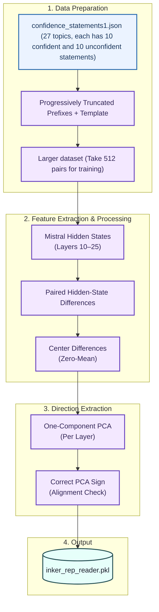
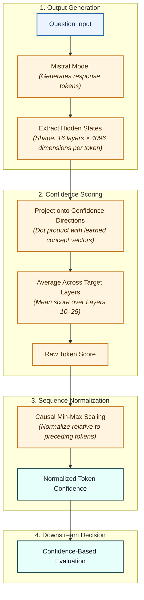

# INKER Confidence Detector Replication

This repository contains a cleaned, modular implementation of the INKER confidence-detector experiment. It loads Mistral-7B-Instruct, learns a confidence direction with paired hidden-state differences and PCA, and evaluates confidence on synthetic statements and generated answers.

This guide is specifically for running the project in **Google Colab** with Google Drive. The default configuration expects a CUDA-capable Colab GPU and stores the trained reader and result files in Drive.

## Pipeline overview

The project has two stages: learn a confidence direction, then use it to score generated answers.

### A. Learn the confidence direction



**In plain language:** the training script creates matched confident and unconfident examples, observes their hidden states, and saves one learned direction for each selected layer.

### B. Score a generated answer



**Why normalization is causal:** when token `i` is scored, only tokens `0...i` can influence its normalized value. Future tokens cannot change an earlier confidence decision.

## Repository structure

```text
inker-confidence-detector/
├── README.md
├── requirements.txt
├── .gitignore
├── configs/default.yaml
├── data/README.md
├── docs/
│   ├── methodology.md
│   ├── replication.md
│   └── results.md
├── experiments/
│   ├── train_detector.py
│   ├── evaluate_detector.py
│   ├── run_confidence_only.py
│   └── run_test_suite.py
└── src/inker/
```

## Artifact layout in Google Drive

The dataset, trained reader, and experiment outputs are stored outside GitHub so they persist after Colab disconnects:

```text
/content/drive/MyDrive/INKER_Confidence_Detector/
├── datasets/confidence_statements1.json
├── models/inker_rep_reader.pkl
├── results/
│   ├── replication/
│   ├── confidence_only/
│   └── full_k/
└── logs/
```

The checked-in `configs/default.yaml` already points to this Drive location.

## 1. Create a Colab notebook and GPU runtime

1. Open [Google Colab](https://colab.research.google.com/).
2. Create a new notebook.
3. Select **Runtime > Change runtime type**.
4. Set **Hardware accelerator** to **GPU**, then save.

Run this first cell:

```python
import torch

print(torch.__version__)
print("CUDA available:", torch.cuda.is_available())
```

Continue only when `CUDA available: True` is printed.

## 2. Mount Google Drive

Run this cell and authorize access when prompted:

```python
from google.colab import drive

drive.mount("/content/drive")
```

Drive stores the trained reader and CSV results so they survive a temporary Colab runtime reset.

## 3. Clone the repository and install dependencies

Run this cell:

```bash
!git clone https://github.com/TalaChehade/confidence-detector.git
%cd confidence-detector
!pip install -q -r requirements.txt
```

If the runtime already contains the folder, skip `git clone` and run only:

```python
%cd confidence-detector
```

## 4. Authenticate with Hugging Face

The model is `mistralai/Mistral-7B-Instruct-v0.1`. You need a Hugging Face account, model access, and a user access token.

1. Open the **Secrets** panel in Colab using the key icon.
2. Add a secret named `HF_TOKEN`.
3. Enable notebook access for that secret.
4. Run this cell:

```python
from google.colab import userdata
from huggingface_hub import login

login(userdata.get("HF_TOKEN"))
```

Never print the token or put it in `default.yaml`, a source file, or a committed notebook.

## 5. Add the dataset to Drive

Obtain the dataset used by the original experiment and place it at:

```text
/content/drive/MyDrive/INKER_Confidence_Detector/datasets/confidence_statements1.json
```

The dataset is not generated by the scripts. Upload it to Drive before continuing. Confirm that Colab can see it:

```python
from pathlib import Path

dataset = Path(
    "/content/drive/MyDrive/INKER_Confidence_Detector/"
    "datasets/confidence_statements1.json"
)
print("Dataset exists:", dataset.exists())
```

The output must be `Dataset exists: True`.

## 6. Review the configuration

The experiment reads `configs/default.yaml`. The default settings are:

- model: `mistralai/Mistral-7B-Instruct-v0.1`;
- 4-bit quantization with `float16` computation;
- hidden layers 10 through 25;
- last-token representation (`rep_token=-1`);
- batch size 32 and maximum input length 512;
- 512 training pairs;
- confidence threshold 0.5;
- maximum 60 generated tokens and repetition penalty 1.1;
- deterministic seed 0.

The default artifact root is `/content/drive/MyDrive/INKER_Confidence_Detector`, with `datasets`, `models`, and `results` beneath it. You normally do not need to edit the configuration.

## 7. Train the confidence detector

Run this Colab cell from the `confidence-detector` directory:

```bash
!python experiments/train_detector.py
```

Training constructs the dataset, extracts hidden states, computes paired differences, fits one PCA direction per layer, applies the label-based sign correction, and saves:

```text
/content/drive/MyDrive/INKER_Confidence_Detector/models/inker_rep_reader.pkl
```

This is the longest step and may require substantial GPU memory. Do not rerun it unless the reader is missing or the training configuration changed.

## 8. Evaluate the synthetic replication

Run after training completes and once you have the inker_rep_reader.pkl file saved:

```bash
!python experiments/evaluate_detector.py
```

This evaluates the synthetic eval and test splits using ROC-AUC, pairwise accuracy, and per-topic behavior. It writes:

```text
results/replication/replication_metrics.csv
results/replication/eval_per_topic.csv
results/replication/test_per_topic.csv
```

## 9. Run confidence-only inference

Run after training completes and once you have the inker_rep_reader.pkl file saved:

```bash
!python experiments/run_confidence_only.py
```

The model generates answers, scores every answer token, averages layers 10 through 25, and applies causal normalization. It writes:

```text
results/confidence_only/confidence_only_questions.csv
results/confidence_only/confidence_only_tokens.csv
```

## 10. Run the full-K test suite

Run after training completes and once you have the inker_rep_reader.pkl file saved:

```bash
!python experiments/run_test_suite.py --eva-model models/eva
```

This writes the generated answers, confidence statistics, fine-tuned Eva
complexity score `E`, full-K trigger, and confidence-only trigger:

```text
results/full_k/test_suite_questions.csv
results/full_k/test_suite_tokens.csv
```

## 11. Train the complexity evaluator (Eva)

The INKER paper uses a fine-tuned T5-Large model (Eva) that estimates query complexity. This model MUST be fine-tuned with specific hyperparameters from the paper before use.

### 11.1 Prepare the training dataset

Download and normalize the official Adaptive-RAG generated-label archive. This
uses its silver labels plus its inductive-bias labels; it does not label queries
with a heuristic:

```bash
!python experiments/prepare_adaptive_rag_data.py \
  --download-to data/adaptive_rag_data.tar.gz \
  --extract-to data/adaptive_rag_official \
  --output /content/drive/MyDrive/INKER_Confidence_Detector/datasets/adaptive_rag_eva.json
```

The official archive has three generated-label sources. The default,
`flan_t5_xl`, matches the original example; choose the label source that
matches the generator used in your experiment with `--label-source gpt` or
`--label-source flan_t5_xxl`.

The archive is the official source and its train/dev queries must remain
disjoint from the QA test queries used for the final experiment. The resulting
JSON has Adaptive-RAG labels: `A` (no retrieval), `B` (single-step retrieval),
and `C` (multi-step retrieval).

For an already extracted official archive, use:

```bash
!python experiments/prepare_adaptive_rag_data.py \
  --data-root data/adaptive_rag_official \
  --output /content/drive/MyDrive/INKER_Confidence_Detector/datasets/adaptive_rag_eva.json
```

Its normalized structure is:

```json
{
    "train": [
        {"question": "What is the capital of France?", "answer": "A"},
        {"question": "Who wrote Hamlet and when?", "answer": "B"},
        {"question": "Which country has a larger population, X or Y, and why?", "answer": "C"},
        ...
    ],
    "validation": [
        {"query": "What are the main causes of climate change?", "complexity": 1},
        ...
    ]
}
```

**Important**: The training corpus must be from open-source data with **NO overlap** with your test queries.

### 11.2 Train Eva with INKER paper hyperparameters

Run the training script with your prepared dataset:

```bash
!python experiments/train_complexity_evaluator.py \
  /content/drive/MyDrive/INKER_Confidence_Detector/datasets/adaptive_rag_eva.json \
  --output-dir /content/drive/MyDrive/INKER_Confidence_Detector/models/eva
```

This trains Eva using the exact hyperparameters from the INKER paper:
- Learning rate: 3e-5
- Max sequence length: 384
- Training batch size: 32
- Evaluation batch size: 100
- Optimizer: AdamW with weight decay 0.01
- Number of epochs: 15

On a Colab T4/L4-size GPU, the training command defaults to a physical batch
of 1 with 32 gradient-accumulation steps, preserving the paper's effective
training batch size of 32. It also enables gradient checkpointing. For
numerical stability, it uses BF16 on supported GPUs and FP32 on T4 GPUs;
do not force FP16 for T5-Large unless you have verified stable losses.

The command saves the trained model to Google Drive, alongside the confidence
detector reader, so it persists across Colab sessions. Reuse it instead of
training again. You can specify a different persistent output directory:

```bash
!python experiments/train_complexity_evaluator.py \
  /content/drive/MyDrive/INKER_Confidence_Detector/datasets/adaptive_rag_eva.json \
  --output-dir /content/drive/MyDrive/INKER_Confidence_Detector/models/eva_custom
```

### 11.3 Test the trained Eva model

After training, test the model on diverse queries:

```bash
!python experiments/test_complexity_evaluator.py --config configs/default.yaml \
  --eva-model /content/drive/MyDrive/INKER_Confidence_Detector/models/eva
```

Results are saved to:
```text
results/complexity_eval/complexity_test_fine-tuned_t5-large_eva.csv
```

### 11.4 Test Eva with generation pipeline

To see how Eva integrates with token generation:

```bash
!python experiments/test_complexity_evaluator.py --config configs/default.yaml \
  --eva-model /content/drive/MyDrive/INKER_Confidence_Detector/models/eva --with-generation
```

This generates answers to test queries and shows how complexity scores $E$ work with token-level confidence $m_{\tilde{i}}$.

## 12. Run combined confidence detector + complexity evaluator

Run the full INKER pipeline after training both components:

```bash
!python experiments/run_combined_detection.py --config configs/default.yaml \
  --eva-model /content/drive/MyDrive/INKER_Confidence_Detector/models/eva
```

This runs the complete INKER system:

1. Estimates query complexity $E$ using the fine-tuned Eva model
2. Scores each generated token for confidence $m_{\tilde{i}}$
3. Computes activation score $K(t_i) = (E - m_{\tilde{i}}) \cdot s_i$ for each content token
4. Triggers retrieval if any $K(t_i)$ exceeds threshold

Results are saved to:

```text
results/full_k/combined_questions.csv
results/full_k/combined_tokens.csv
```

Key columns in the results:
- **E**: Query complexity score (0=simple, 1=complex)
- **mean_m_tilde**: Average token confidence for content tokens
- **max_K**: Maximum activation score among tokens
- **would_trigger_full**: Whether full K method triggers
- **would_trigger_confidence_only**: Whether confidence-only method triggers

### 12.1 Testing on subset of data

To test on a smaller subset (useful for quick validation):

```bash
!python experiments/run_combined_detection.py --config configs/default.yaml --eva-model models/eva --num-questions 20
```

## Implementation Details

### Complexity Score (E) Formula

Eva is a fine-tuned T5-Large *generative* three-class classifier, matching
Adaptive-RAG: `A` = no retrieval, `B` = single-step retrieval, and `C` =
multi-step retrieval. It reports the static normalized expected complexity:

$$E = 0\cdot P(A) + 0.5\cdot P(B) + 1\cdot P(C)$$

Thus `E` is in `[0, 1]`, while the CSV exports retain the predicted class and
all three probabilities for auditability. There is no heuristic
`estimate_complexity_evaluator` or pre-trained fallback.

### Activation Score (K) Formula

$$K(t_i) = (E - m_{\tilde{i}}) \cdot s_i$$

Where:
- $E$ = Query complexity from Eva (0-1)
- $m_{\tilde{i}}$ = Normalized token confidence (0-1)
- $s_i$ = Content indicator (1 for non-stop-words, 0 otherwise)
- $K(t_i)$ = Activation score for token i

**Decision Rule**: Trigger retrieval if any content token has $K(t_i) > 0.5$

### Eva Training Hyperparameters (from INKER paper)

| Hyperparameter | Value |
|---|---|
| Base Model | T5-Large (0.77B parameters) |
| Learning Rate | 3e-5 |
| Max Sequence Length | 384 |
| Document Stride | 128 |
| Training Batch Size | 32 |
| Evaluation Batch Size | 100 |
| Optimizer | AdamW (weight decay: 0.01) |
| Number of Epochs | 15 |
| Evaluation Metric | F1 Score |

## Results Analysis

